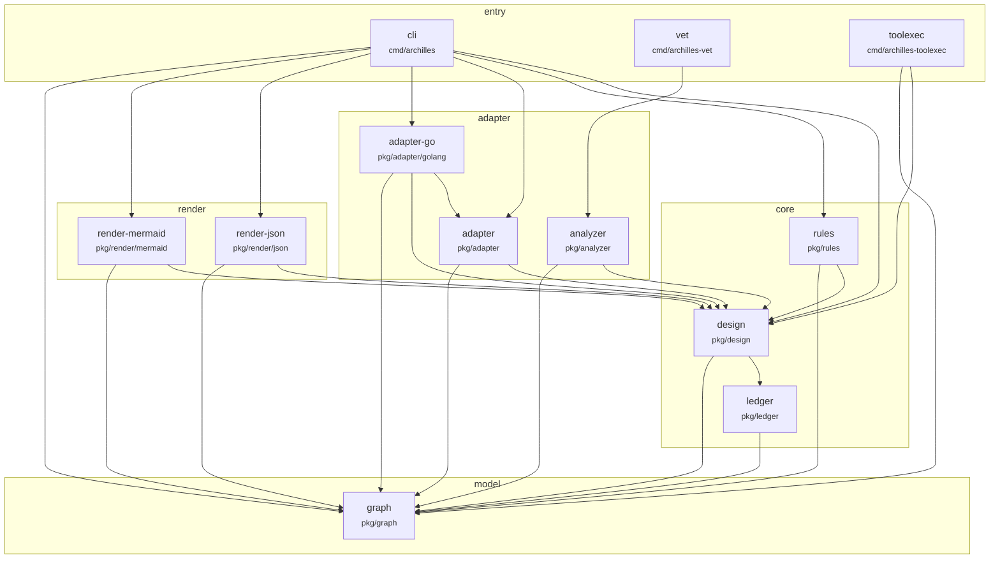

# archilles — intended architecture

Hand-drawn rendering of the intended component graph, in the conventions `pkg/render/mermaid` will emit. When step 5 of the build order lands, `archilles graph --intended` must reproduce this; a mismatch is a bug in the renderer or in this drawing, and finding out which is the point of drawing it first.

**Status: draft for review. Not accepted.** The open decisions are listed at the bottom — they are design choices the drawing forced, and they are James's to make, not settled by having been drawn.

## Intended graph

Solid edge = allowed and expected. Edges are default-deny: anything not drawn here is a violation.

## What the drawing asserts

- **`graph` depends on nothing.** It is the normalized model — `Node`, `Edge`, `Level`, `Collapse`, the diff. Pure types and set operations, no I/O, no knowledge of YAML, Go, or rendering. Everything points at it; it points at nothing.
- **Core never points up.** `design`, `rules`, `ledger` know nothing of adapters or renderers. This is the rule that makes a second language adapter possible without touching core.
- **Language-awareness is confined to `L1`.** `adapter-go` and `analyzer` are the only components that may import `go/types`, `go/packages`, or `go list`. Core operating on the normalized graph is what makes the Terragrunt adapter a v1 addition rather than a rewrite.
- **Renderers are siblings of adapters, not of each other's consumers.** Both read the diff and the design; neither knows the other exists. `render-json` is the contract — `render-mermaid` and the text output are renderings of the same struct.
- **Nothing imports `cmd/`.** Three entrypoints, each a thin wrapper: `cli` wires everything, `vet` wraps only the analyzer, `toolexec` needs only enough to check a package's imports against the resolved design.

## Open decisions — for review, not settled

1. **Is `analyzer` an adapter?** I placed it in `L1` because it is Go-specific — it reads Go imports via `go/analysis`, which is exactly the language-awareness the layering confines to adapters. But the handoff lists it as `pkg/analyzer`, a sibling of `pkg/adapter`, not underneath it. If it stays at `pkg/analyzer` while being language-aware, the "adapters are the only language-aware code" principle needs rewording, or the package needs moving to `pkg/adapter/golang/analyzer`. **This is a real conflict in the handoff, not a drawing detail.**

2. **Does `render` belong in the layer order at all?** The handoff's example principle is `order: [entry, adapter, core]` and goal 1 suggests `entry → adapter → core → model`. Renderers fit nowhere in that line. I invented an `L2` for them.

3. **The `layer` kind is linear and cannot express siblings.** `adapter` and `render` are independent — neither should import the other. A linear order permits whichever is listed higher to import the lower one. Expressing "these two are parallel" needs either a `forbid-edge` pair alongside the layer rule, or a non-linear layer kind, which would be a fifth rule kind and is out of scope for v0. A `forbid-edge` pair is the v0-shaped answer, but it means the layer rule alone does not carry the intent.

4. **Does `ledger` depend on `graph`?** Drawn as yes, on the assumption records carry selectors expressed over node/tag types. If records are pure data with no reference to the graph model, this edge should be deleted and `ledger` becomes a second dependency-free leaf.

5. **`design → ledger`, or the reverse?** Drawn with `design` folding records held by `ledger`. The alternative is `ledger` owning the fold and `design` consuming the result, which flips the edge. The handoff puts "resolver (fold principles+exceptions → rules)" in `pkg/design` and "append-only, fold" in `pkg/ledger` — both claim the fold.

6. **`internal/archgate` is not drawn.** It is generated, gitignored, and imported by every `main` for its side effect of failing the build when absent. It is a component by the path-prefix rule and will show as `undeclared-component` unless the design names it or the extractor excludes generated files.
